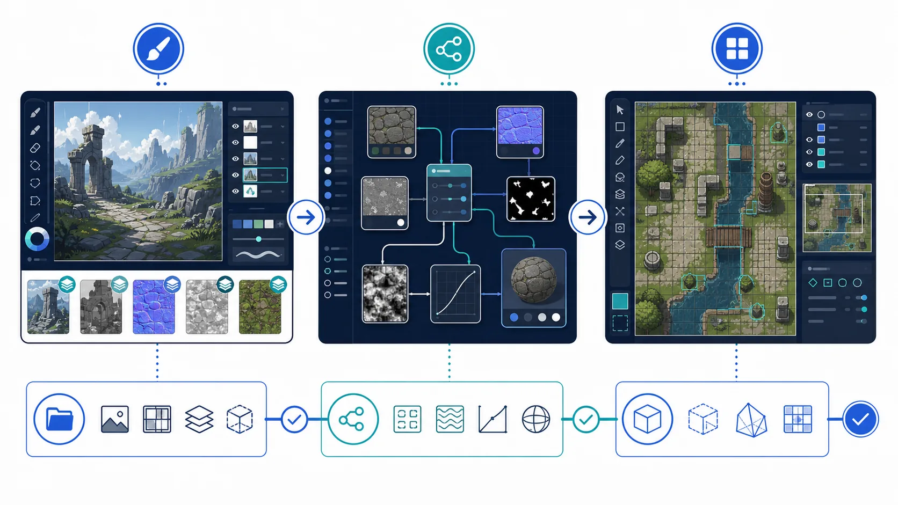

# dcc-mcp-krita


Krita adapter for the DCC Model Context Protocol ecosystem.



The adapter uses a small Krita Python plug-in and a loopback JSON-lines bridge.
The MCP server runs in the normal Python environment; KRITA API calls stay inside
the plug-in process. It does not expose arbitrary Python or Script-Fu execution.

## Install

```bash
pip install dcc-mcp-krita
dcc-mcp-krita-install
```

Restart Krita, enable the bundled Python plug-in, then start:

```bash
dcc-mcp-krita
```

The MCP endpoint defaults to `http://127.0.0.1:8767/mcp`; the plug-in bridge uses
`127.0.0.1:3848`. Override the latter with `DCC_MCP_KRITA_BRIDGE_PORT` before
starting both processes.

## Current tools

- Check KRITA bridge status and version.
- List open images with dimensions.
- Inspect the active image.

The first release targets safe session discovery. Image mutation and export will
be added only through typed KRITA procedures, not arbitrary source evaluation.

## Development

```bash
python -m pip install -e ".[dev]"
python -m pytest
python -m ruff check src tests tools
python tools/lint_skills.py
python -m build
python -m twine check dist/*
```

Krita plug-in API reference: https://developer.krita.org/api/3.0/
